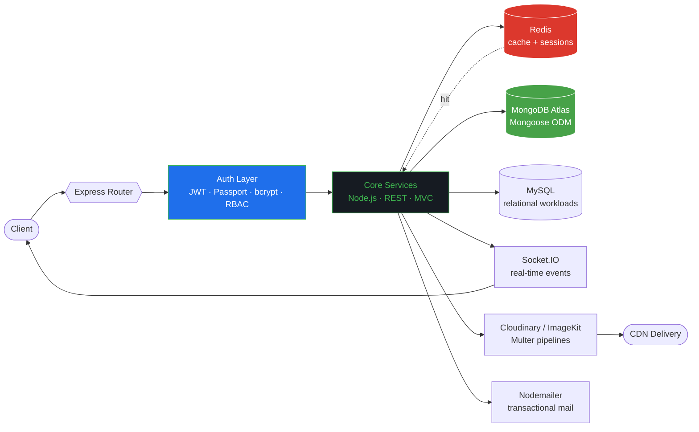
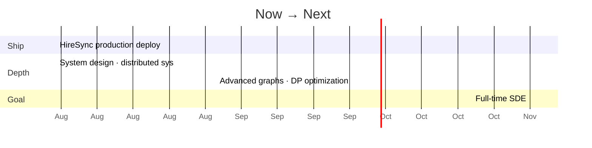

<div align="center">


<br/>

<a href="https://www.linkedin.com/in/priyank---saxena/"></a>
<a href="mailto:priyank0saxena@gmail.com"></a>
<a href="https://leetcode.com/u/priyanksaxenaa01/"></a>
<a href="https://github.com/PriyankSaxenaa"></a>


</div>

---

## `GET /v1/profile`


```http
HTTP/1.1 200 OK
Content-Type: application/json
X-Powered-By: Node.js, C++, and an unreasonable amount of chai
Cache-Control: no-cache, always-shipping
```

```json
{
  "name": "Priyank Saxena",
  "role": "Backend Engineer (SDE)",
  "education": "B.Tech CSE — Final Year",
  "location": "India · open to relocate",
  "primary_stack": ["Node.js", "Express", "MongoDB", "Redis", "Socket.IO"],
  "algorithms": { "solved": "700+", "leetcode": 1700, "codeforces": 1214 },
  "currently_deploying": "HireSync → production",
  "availability": "IMMEDIATE",
  "open_to": ["Backend Internships", "Full-time SDE"]
}
```

<br clear="right"/>

---

## `GET /v1/architecture` — how I'm built

> Not a skill list. This is the actual request path through everything I've shipped.



<div align="center">


</div>

---

## `GET /v1/services` — deployed & running

<table>
<tr><th>Service</th><th>What it does</th><th>Status</th></tr>
<tr>
  <td><b>HireSync</b></td>
  <td>Unified campus + off-campus recruitment platform</td>
  <td></td>
</tr>
<tr>
  <td><b>SoundWave</b></td>
  <td>Production-grade music streaming API backend</td>
  <td></td>
</tr>
</table>

<br/>


### 🏢 HireSync — Unified Recruitment Platform

> **Picture a final-year student.** 12 tabs open — Internshala, LinkedIn, Naukri, the college portal, three WhatsApp groups, and 847 unread emails.
> Their dream placement is somewhere in that mess.
> **They will never see it.**

```diff
- Opportunities scattered across 10+ platforms
- Campus drives buried in Gmail threads
- Zero unified view of applications
+ One platform. Every opportunity. Zero missed deadlines.
```

<details>
<summary><b>▸ Engineering breakdown</b> — click to expand</summary>

<br/>

| Subsystem | Implementation |
|---|---|
| **Access control** | 4 roles (Candidate · Recruiter · TPO · Admin), every route gated by RBAC middleware |
| **Resume pipeline** | PDF upload → parse → automatic skill extraction → indexed profile |
| **Campus drives** | Structured drive lifecycle replacing ad-hoc Gmail threads |
| **Bulk onboarding** | Excel/CSV ingestion so TPOs onboard entire batches in one shot |
| **Real-time layer** | Socket.IO push notifications on deadlines and status changes |
| **Matching** | Skill-vector job recommendations against the extracted resume profile |
| **Analytics** | Drive metrics, funnel tracking, application-state dashboards |
| **Performance** | Redis caching on hot read paths, indexed Mongo queries |

**Stack** — `Node.js` `Express` `MongoDB` `Redis` `Socket.IO` `JWT` `Cloudinary` `Nodemailer` `Multer`

</details>

<a href="https://github.com/PriyankSaxenaa/Hiresync-backend"></a>

<br clear="right"/>

<br/>


### 🎵 SoundWave — Music Streaming Backend

> A Spotify-inspired API built to prove one thing: clean, secure, scalable REST design under real constraints.

<details>
<summary><b>▸ Engineering breakdown</b> — click to expand</summary>

<br/>

| Subsystem | Implementation |
|---|---|
| **Auth** | Stateless JWT sessions, hashed credentials |
| **Roles** | Artist vs User — separate permission surfaces on shared resources |
| **APIs** | Full CRUD for Songs & Albums with pagination and filtering |
| **Media** | ImageKit-backed uploads with Multer streaming and optimization |
| **Design** | Strict MVC separation, RESTful contracts, predictable error shapes |

**Stack** — `Node.js` `Express` `MongoDB` `JWT` `ImageKit` `Multer`

</details>

<a href="https://github.com/PriyankSaxenaa/SoundWave"></a>

<br clear="left"/>

---

## `GET /v1/benchmarks` — problem solving


```
┌───────────────────────────────────────────────────┐
│  BENCHMARK RESULTS                    700+ RUNS   │
├───────────────────────────────────────────────────┤
│  LeetCode      priyanksaxenaa01        1700+  ⭐  │
│  Codeforces    priyank___saxena     1214 Pupil 🏁 │
│  Total solved  all platforms             700+  🧩 │
├───────────────────────────────────────────────────┤
│  Strongest:   Graphs · DP · Binary Search         │
│  Drilling:    DP optimization · Advanced graphs   │
│  Language:    C++  (fallback: JavaScript)         │
└───────────────────────────────────────────────────┘
```

🥈 **2nd Place** — Intercollege Ideathon

<br clear="right"/>

---

## `GET /v1/changelog`

```
v3.0  ▸  HireSync — 4-role platform, real-time layer, Redis caching
v2.5  ▸  Crossed 700 DSA problems · LeetCode 1700+
v2.0  ▸  SoundWave — first production-grade API backend
v1.5  ▸  Codeforces Pupil · 2nd place, Intercollege Ideathon
v1.0  ▸  First line of C++. Never stopped.
```

<details>
<summary><b>▸ /v1/incidents</b> — things that broke, and what I learned</summary>

<br/>

| Incident | Root cause | Fix | Takeaway |
|---|---|---|---|
| Slow job feed | Unindexed Mongo queries on every request | Compound indexes + Redis cache layer | Measure before optimizing — the DB tells you where it hurts |
| Notification storms | Socket events emitted per-write, unbatched | Batched emits + room-scoped broadcasts | Real-time ≠ every-time |
| Resume parse failures | Assumed uniform PDF structure | Defensive parsing + graceful fallbacks | User input is always weirder than your test file |

*Real engineering is mostly debugging. I'd rather show that than hide it.*

</details>

---

## `GET /v1/roadmap`



---

<div align="center">

## `GET /v1/metrics`


</div>

---

<div align="center">

## `POST /v1/hire`

</div>

```js
const evaluate = (role) => {
  const wantsBackend = role.stack.some(t =>
    ["node", "express", "mongodb", "redis", "system-design"].includes(t)
  );

  if (wantsBackend && role.type === "SDE") {
    return {
      status: 200,
      response: "Let's talk. I ship, I debug, and I don't need hand-holding.",
      responseTime: "< 6 hours",
      contact: "priyank0saxena@gmail.com"
    };
  }

  return { status: 200, response: "Still interested — I learn fast." };
};
```

<div align="center">

| Endpoint | SLA | Status |
|---|---|---|
| Recruiter email | `< 6h` | 🟢 |
| Take-home assignment | `< 48h` | 🟢 |
| Notice period | `0 days` | 🟢 |

<br/>

<a href="https://www.linkedin.com/in/priyank---saxena/"></a>
<a href="mailto:priyank0saxena@gmail.com"></a>

<br/><br/>


> ### *"Build skills so strong that opportunities chase you."*


</div>
