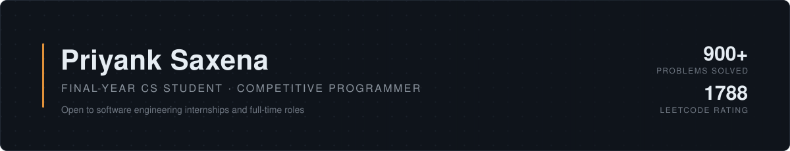

 

I'm a final-year computer science student. Most of my time goes into **competitive programming** — timed online contests where thousands of people race to solve algorithm problems in ninety minutes. I've solved over 900 of them.

The rest of my time goes into building web applications, end to end, until they're deployed and working.

I'm looking for a software engineering internship or a full-time role.

 

**[LinkedIn](https://www.linkedin.com/in/priyank---saxena/)** &nbsp;·&nbsp; **[Email](mailto:priyank0saxena@gmail.com)** &nbsp;·&nbsp; **[LeetCode](https://leetcode.com/u/priyanksaxenaa01/)** &nbsp;·&nbsp; **[Live project](https://myhiresync.vercel.app/)**

 

---

 

## Competitive programming

|  | |
|---|---|
| **Problems solved** | 900+, across all platforms |
| **LeetCode** | Rating 1788 · [priyanksaxenaa01](https://leetcode.com/u/priyanksaxenaa01/) |
| **Codeforces** | Pupil, 1214 · priyank\_\_\_saxena |
| **Language of choice** | C++ |
| **Strongest areas** | Graphs, dynamic programming, binary search |
| **Recognition** | 2nd place, Intercollege Ideathon |

Contests are the closest thing programming has to a sport. Ninety minutes, no hints, no second attempt at a wrong submission. It has taught me to read a problem and find the shape of it quickly, to pick the efficient approach rather than the first one that occurs to me, and to keep going after the first three ideas fail.

Why this matters for the job

 

| In a contest | On a team |
|---|---|
| Find the trick in a problem within minutes | Get up to speed on an unfamiliar codebase quickly |
| Choose the efficient approach, not the first one | Write software that holds up as usage grows |
| Debug with no hints and a clock running | Stay useful when something breaks in production |
| Lose, review the editorial, return next week | Take code review without ego |

Most technical interviews at large software companies are built on exactly these problems. I've been preparing for that conversation for years.

 

---

 

## Projects

Both are personal projects — built to learn, not for a client, so there's no user base behind them. They're deployed, they work, and I can explain every decision inside them.

### HireSync

A final-year student's job opportunities are scattered across ten websites, several WhatsApp groups and an overflowing inbox. Good openings get missed because nobody saw them in time.

HireSync brings them into one place. Students, recruiters and college placement officers each get their own view of the same system, and everyone is notified the moment something changes.

Node.js · Express · MongoDB · Redis · Socket.IO

**[Open the live site](https://myhiresync.vercel.app/)** &nbsp;·&nbsp; **[View the code](https://github.com/PriyankSaxenaa/Hiresync-backend)**

### SoundWave

I wanted to understand what actually happens underneath the play button on a service like Spotify, so I built the engine behind one — accounts and logins, separate permissions for artists and listeners, song and album libraries, and image uploads.

Node.js · Express · MongoDB · JWT · ImageKit

**[View the code](https://github.com/PriyankSaxenaa/SoundWave)**

 

---

 

## Tools

**Languages** — C++, JavaScript, SQL
**Backend** — Node.js, Express, REST APIs
**Data** — MongoDB, MySQL, Redis
**Everyday** — Git, GitHub, Postman, VS Code

 

 

---

 

## Get in touch

I reply to every message.

**[LinkedIn](https://www.linkedin.com/in/priyank---saxena/)** &nbsp;·&nbsp; **priyank0saxena@gmail.com**
